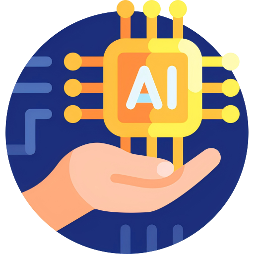

# JH's AI Learning Website



## 项目简介

这是一个用于记录和分享现今前沿AI技术的学习网站。

## 项目特色

本项目由AI大语言模型【独立完成】，本人只负责整理编码、调试、发布 : )

## 当前项目进度

```plaintext
src
├── App.vue
├── assets
│   ├── logo.png
│   └── styles
│       └── main.css
├── components
│   └── NavBar.vue
├── main.js
├── router
│   └── index.js
└── views
    ├── Home.vue
    ├── SiteDetail.vue
    └── SiteList.vue
```

## 技术栈

* 前端：Vue
* AI Agent：Dify
* RAG：PostgreSQL
* LLM：Qwen2:7b
* Agent Tools：Python、Flask

## 许可证

[MIT](LICENSE)

## 联系

如有任何问题或建议，请联系 [jacksonzjh](https://github.com/jacksonzjh)。